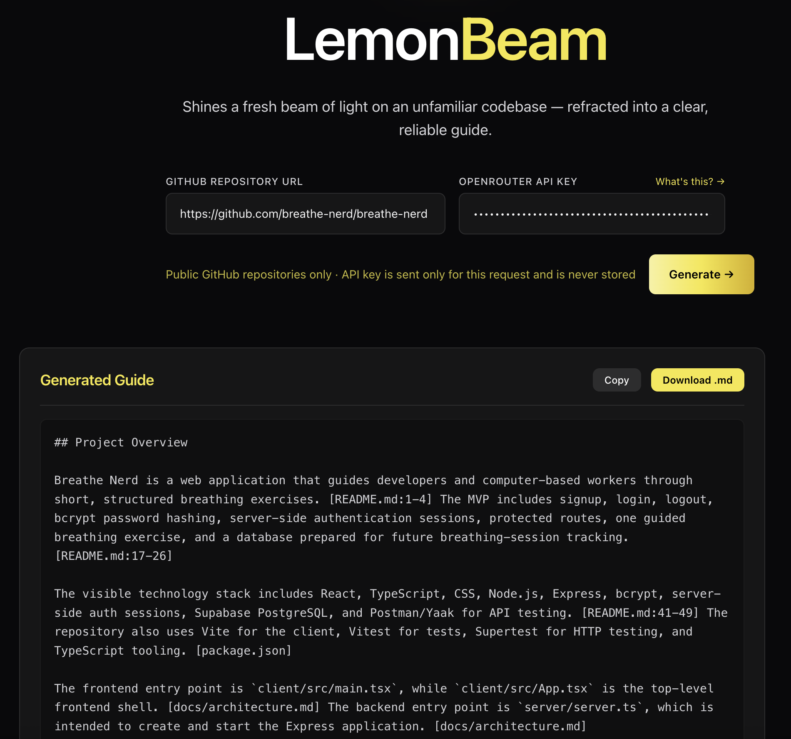

# LemonBeam 🍋

LemonBeam shines a fresh beam of light on an unfamiliar codebase.

LemonBeam is a source-backed onboarding guide generator for public GitHub repositories. It helps developers understand a JavaScript or TypeScript project by scanning the repository, selecting relevant evidence, and generating a contributor-oriented guide with citations back to the source.

Instead of asking an LLM to reason over an entire repository at once, LemonBeam breaks the repo into meaningful pieces, ranks useful evidence, keeps the prompt within a token budget, and returns a structured guide that new contributors can inspect and verify.

## Try LemonBeam

[Launch LemonBeam](https://TODO-add-deployed-url.example.com)

Paste a public GitHub repository URL, enter your OpenRouter API key, and generate a source-backed onboarding guide.

## Demo



_LemonBeam generating a source-backed onboarding guide with inline repository citations._

[Watch the LemonBeam demo video](docs/assets/lemonbeam-demo.mov)

## What LemonBeam Generates

LemonBeam produces a fixed-format onboarding guide with sections for:

- Project Overview
- Setup / Installation
- Running Locally
- Project Structure
- Testing
- Uncertainties and Missing Information

Each guide is generated from repository evidence selected for the scan. When LemonBeam cannot confidently analyze something, it reports that uncertainty instead of silently pretending the information was available.

## Who It Is For

LemonBeam is built for:

- developers joining an unfamiliar codebase
- open-source contributors deciding where to start
- maintainers who want a quick contributor-facing guide

## Why LemonBeam?

Developer onboarding information is often scattered across README files, package scripts, configuration files, source folders, and test suites.

General-purpose AI tools can often produce readable repository summaries, but readable is not always reliable. LemonBeam focuses on making repository guides more:

- **grounded** — generated from selected repository evidence
- **inspectable** — connected to source citations
- **consistent** — returned in a predictable guide format
- **bounded** — designed to stay within token limits instead of dumping an entire repo into a model
- **honest** — skipped or excluded evidence is surfaced in the guide

## How To Use The Web App

1. Open the deployed LemonBeam app.
2. Paste a public GitHub repository URL.
3. Enter your OpenRouter API key.
4. Generate the guide.
5. Review the Markdown guide and use the citations to inspect the source files behind the claims.

LemonBeam currently supports public JavaScript and TypeScript GitHub repositories. Private repositories, monorepos, and non-GitHub providers are outside the current launch scope.

## Local Development

### Prerequisites

- Node.js
- npm
- An OpenRouter API key for guide generation
- A GitHub personal access token is recommended for repository validation rate limits

### Install

```bash
git clone <repository-url>
cd lemonbeam

npm install

cd frontend
npm install

cd ../backend
npm install
```

### Configure Environment

Create a local backend environment file:

```bash
cp backend/.env.example backend/.env
```

Then update `backend/.env` as needed:

```env
OPENROUTER_API_KEY=your-openrouter-api-key-here
GITHUB_TOKEN=your-github-token-here
PORT=3000
```

For the web app, LemonBeam uses a bring-your-own-key flow: the OpenRouter key is normally entered in the UI for each scan and is not stored by the frontend.

### Run The App

From the project root:

```bash
npm run dev
```

This starts the frontend and backend development servers together.

You can also run them separately:

```bash
npm run dev:frontend
npm run dev:backend
```

## Running Tests

From the project root:

```bash
npm test
```

For watch mode:

```bash
npm run test:watch
```

Frontend linting:

```bash
npm run lint
```

Backend type checking:

```bash
cd backend
npm run typecheck
```

## Technology Stack

### Frontend

- React
- TypeScript
- Vite
- Tailwind CSS

### Backend

- Node.js
- Express
- TypeScript
- GitHub API
- OpenRouter API
- Tree-sitter
- tiktoken
- SQLite utilities

## Optional Local Interfaces

The primary launch experience is the web app, but the repository also includes local interfaces for experimentation.

### CLI

LemonBeam can also be run locally as a CLI to scan a project directory and generate an onboarding guide.

#### 1. Configure Your Environment

The simplest way to run the CLI is to pass your OpenRouter key directly with the `--key` flag when you run the command.

You can also create a `.env` file in the directory where you plan to run the CLI if you do not want to pass the key every time:

```env
OPENROUTER_API_KEY=your-openrouter-api-key-here
```

#### 2. Clone, Build, And Link LemonBeam

```bash
git clone https://github.com/oslabs-beta/lemonbeam.git
cd lemonbeam
npm install
npm run build
npm link
```

#### 3. Run The CLI

From the root of the project you want to scan:

```bash
npx lemonbeam --key your-openrouter-api-key-here
```

If you configured `OPENROUTER_API_KEY` in `.env`, you can run:

```bash
npx lemonbeam
```

By default, the CLI scans the current directory. You can also pass a local project path or supported GitHub repository URL.

### MCP Server

LemonBeam can also run as a local MCP server, allowing Claude Desktop, Claude Code, or another MCP-compatible client to call LemonBeam as a tool.

#### 1. Build The Server

```bash
git clone https://github.com/oslabs-beta/lemonbeam.git
cd lemonbeam
npm install
npm run build
```

#### 2. Get An API Key

Create an OpenRouter key at [openrouter.ai/keys](https://openrouter.ai/keys).

#### 3. Add LemonBeam To Your MCP Client

Add this to your MCP client config, replacing the path and key with your local values:

```json
{
  "mcpServers": {
    "lemonbeam": {
      "command": "node",
      "args": ["/absolute/path/to/lemonbeam/dist/mcp/index.js"],
      "env": {
        "OPENROUTER_API_KEY": "your-key-here"
      }
    }
  }
}
```

Config locations:

- **Claude Desktop:** Settings → Developer → Edit Config
- **Claude Code:** `.mcp.json` in your project root

After saving the config, fully restart your MCP client.

#### 4. Try It

Ask your assistant:

```text
Generate an onboarding guide for https://github.com/owner/repo
```

See the [in-app MCP setup guide](https://TODO-add-deployed-url.example.com/#mcp) for the walkthrough and troubleshooting notes.

## Project Documentation

- `PROJECT_BRIEF.md` — product goals, MVP scope, guide format, user flow, and evaluation plan
- `ARCHITECTURE.md` — system architecture and backend design
- `API_CONTRACT.md` — frontend/backend API specification
- `DATABASE.md` — SQLite schema notes and lifecycle
- `TESTING.md` — testing strategy
- `DECISIONS.md` — architectural decisions and rationale
- `CONTRIBUTING.md` — contributor workflow
- `AGENTS.md` — instructions for AI coding agents

## Get Involved

We welcome contributions to LemonBeam.

1. Fork the repository.
2. Create a feature branch:

   ```bash
   git checkout -b feature/your-feature-name
   ```

3. Make your changes and add or update tests when behavior changes.
4. Commit your work:

   ```bash
   git commit -m "Add your feature description"
   ```

5. Push your branch:

   ```bash
   git push origin feature/your-feature-name
   ```

6. Open a pull request with a clear summary and testing notes.

The LemonBeam team will review your pull request and provide feedback.

## Looking Ahead

- Stronger citation validation
- Better uncertainty summaries
- Better error reporting
- Larger repository support
- Broader language support
- Private repository support

## License

LemonBeam is open source under the [MIT License](LICENSE).
